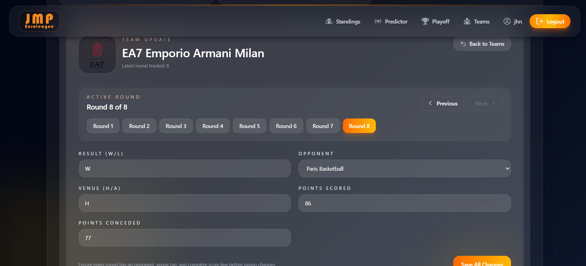
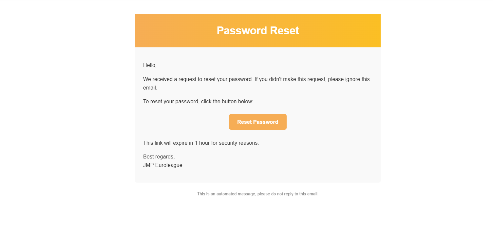

# [JMP Euroleague 🏀](https://www.jmpeuroleague.com/)

**JMP Euroleague** is a web app that predicts Euroleague basketball match outcomes using a modified **ELO rating system**.  
It tracks **real-world team performance** and calculates win probabilities, helping fans explore standings, playoff scenarios, and team stats.

🚀 Built with the **MERN Stack** (MongoDB, Express.js, React, Node.js).

---

## 🆕 Introducing **Rating 2.0**

**Rating 2.0** is a major step forward in how Euroleague team performance is modeled and predicted.  
Unlike *Rating 1.0*, which started all teams at a fixed **1000-point baseline** and updated purely through match results, the new version establishes **data-driven initial ratings** built from player-level analytics.  
Each player’s **JMP Efficiency Index (JEI)** is calculated from detailed game statistics, weighted by recency and playing time, then aggregated at the team level with an exponential depth model—ensuring that top performers matter most, but overall roster quality still counts.
The result is a more dynamic, context-aware system that produces **realistic base ratings and smarter win probabilities**—a truer reflection of each team’s strength in real time.

---

## 🆕 Recent Updates

- **2025/26 Season Ready** – Restructured team models with per-match tracking arrays for detailed season analytics.
- **Performance Optimizations** – Replaced collapsible multi-input forms with round-by-round navigation, eliminated laggy rendering, and moved rating calculations to admin-controlled manual triggers.
- **Enhanced UI/UX** – Added dropdown team selectors, color-coded point differentials, hover tooltips, improved sorting logic, and smoother animations throughout.
- **Code Quality** – Improved component reusability, removed duplicate logic between frontend/backend, cleaned up unused code, and reorganized old implementations into archive.

---

## ✨ Features

- 📊 **Standings Page** – View updated team rankings.
- 🔮 **Predictor Page** – See win probabilities for upcoming games.
- 🏆 **Playoff Page** – Explore playoff brackets and scenarios.
- 📈 **Team Stats Page** – Detailed team statistics and trends.
- 👤 **Profile Page** – User accounts with authentication.
- 🔐 **Auth System** – Login, signup, logout, forgot password and email verification.
- 🛡️ **Security** – JWT-based authentication with short- and long-lived tokens (stored via cookies).
- ☁️ **Cloudinary Integration** – Store and serve team logos.
- 📧 **Email Verification** – Mailtrap integration for secure testing.

---

## 🛠️ Tech Stack

**Frontend**

- React
- React Router
- React Icons
- Zustand
- TailwindCSS
- DaisyUI
- Motion
- React Hot Toast

**Backend**

- Node.js
- Express.js
- MongoDB (Mongoose)
- bcryptjs
- cookie-parser
- jsonwebtoken

**Other Tools**

- Dotenv (env variables)
- Cloudinary (image hosting)
- Mailtrap (email testing)

---

## ⚙️ Environment Setup

Create a `.env` file in the root directory:

```bash
MONGO_URI=your_mongo_uri
PORT=5000

ACCESS_TOKEN_SECRET=your_secret_key
REFRESH_TOKEN_SECRET=your_secret_key

CLOUDINARY_CLOUD_NAME=your_cloud_name
CLOUDINARY_API_KEY=your_api_key
CLOUDINARY_API_SECRET=your_api_secret

MAILTRAP_API_TOKEN=your_mailtrap_api_token

CLIENT_URL=your_client_url

NODE_ENV=development
```

---

## ▶️ Running the app

Build it and then just start it. These are commands:
`npm run build`
and
`npm run start`

---

## 📸 Screenshots

### 🔐 Admin Pages

<p align="center">
  
</p>

<p align="center">
  
</p>

<p align="center">
  
</p>

<p align="center">
  
</p>

#

### 📊 Standings

Check out the [Standings Comparison](https://jhn30.github.io/JMP-Euroleague/comparison-standings.html) to see the difference!

#

### 🔮 Predictor

<p align="center">
  
</p>

<p align="center">
  
</p>

#

### 🏆 Playoff


#

### 📈 Team Stats

<p align="center">
  
</p>

<p align="center">
  
</p>

<p align="center">
  
</p>

<p align="center">
  
</p>

#

### 🔐 Auth Pages

<p align="center">
  
</p>

<p align="center">
  
</p>

<p align="center">
  
</p>

<p align="center">
  
</p>

<p align="center">
  
</p>

#

### 📧 Emails

<p align="center">
  
</p>

<p align="center">
  
</p>

<p align="center">
  
</p>

<p align="center">
  
</p>

---
