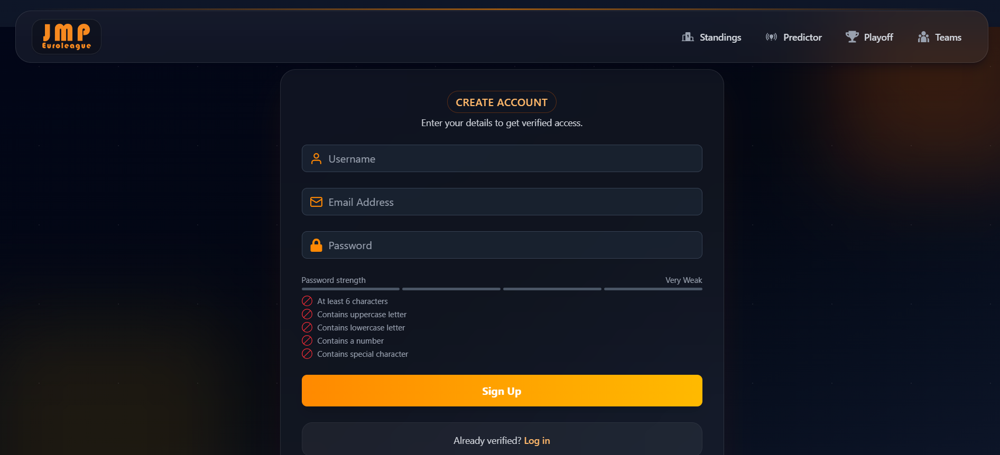
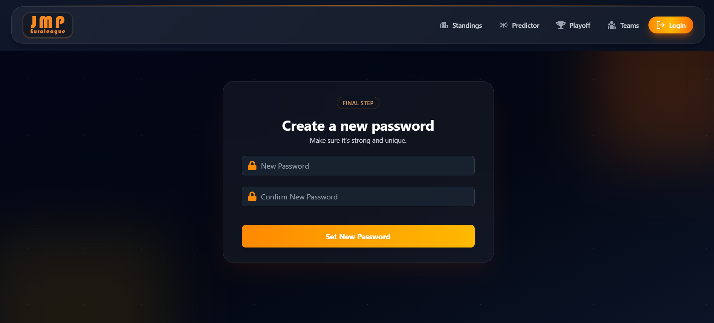
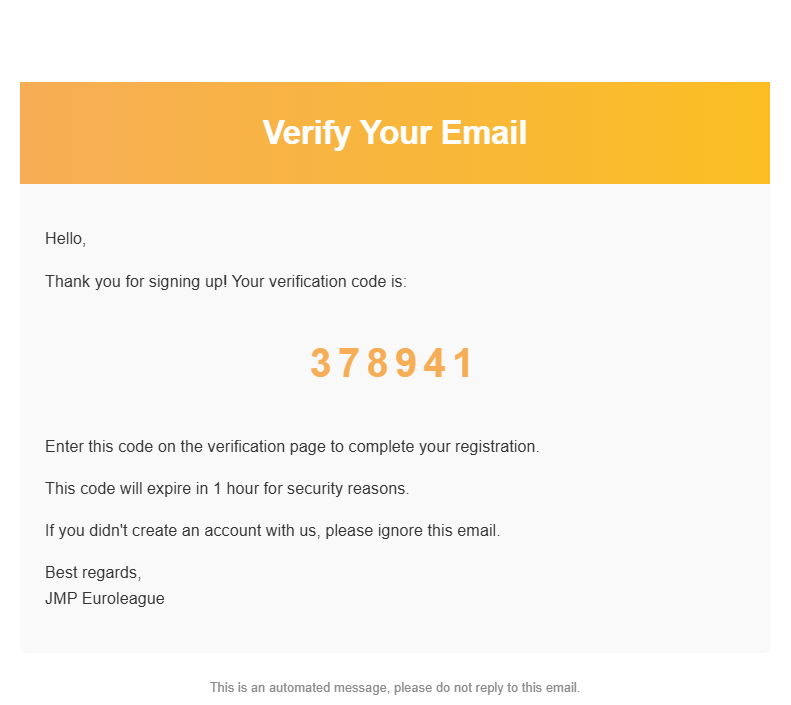
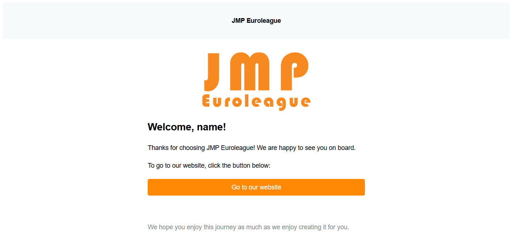

# [JMP Euroleague](https://www.jmpeuroleague.com/)

**JMP Euroleague** is a web app that predicts Euroleague basketball match outcomes using a modified **ELO rating system**.  
It tracks **real-world team performance** and calculates win probabilities, helping fans explore standings, playoff scenarios, and team stats.

Built with the **MERN Stack** (MongoDB, Express.js, React, Node.js).

---

## JMP Rating

For more information about **JMP Rating** click [here](https://github.com/JHN30/JMP-Rating)

---

## Recent Updates

- **2025/26 Season Ready** – Restructured team models with per-match tracking arrays for detailed season analytics.
- **Performance Optimizations** – Replaced collapsible multi-input forms with round-by-round navigation, eliminated laggy rendering, and moved rating calculations to admin-controlled manual triggers.
- **Enhanced UI/UX** – Added dropdown team selectors, color-coded point differentials, hover tooltips, improved sorting logic, and smoother animations throughout.
- **Code Quality** – Improved component reusability, removed duplicate logic between frontend/backend, cleaned up unused code, and reorganized old implementations into archive.

---

## Features

- **Standings Page** – View updated team rankings.
- **Predictor Page** – See win probabilities for upcoming games.
- **Playoff Page** – Explore playoff brackets and scenarios.
- **Team Stats Page** – Detailed team statistics and trends.
- **Profile Page** – User accounts with authentication.
- **Auth System** – Login, signup, logout, forgot password and email verification.
- **Security** – JWT-based authentication with short- and long-lived tokens (stored via cookies).
- **Cloudinary Integration** – Store and serve team logos.
- **Email Verification** – Mailtrap integration for secure testing.

---

## Tech Stack

**Frontend**

- React
- React Router
- React Icons
- Zustand
- TailwindCSS
- DaisyUI
- Motion
- React Hot Toast

**Backend**

- Node.js
- Express.js
- MongoDB (Mongoose)
- MSSQL
- bcryptjs
- cookie-parser
- jsonwebtoken

**Other Tools**

- Dotenv (env variables)
- Cloudinary (image hosting)
- Mailtrap (email testing)

---

## Environment Setup

Create a `.env` file in the root directory:

```bash
MONGO_URI=your_mongo_uri
PORT=5000

ACCESS_TOKEN_SECRET=your_secret_key
REFRESH_TOKEN_SECRET=your_secret_key

CLOUDINARY_CLOUD_NAME=your_cloud_name
CLOUDINARY_API_KEY=your_api_key
CLOUDINARY_API_SECRET=your_api_secret

MAILTRAP_API_TOKEN=your_mailtrap_api_token

CLIENT_URL=your_client_url

NODE_ENV=development
```

---

## Running the app

Build it and then just start it. These are commands:
`npm run build`
and
`npm run start`

---

## Screenshots

### Admin Pages

<p align="center">
  
</p>

<p align="center">
  
</p>

<p align="center">
  
</p>

<p align="center">
  
</p>

#

### Standings

Check out the [Standings Comparison](https://jhn30.github.io/JMP-Euroleague/comparison-standings.html) to see the difference!

#

### Predictor

<p align="center">
  
</p>

<p align="center">
  
</p>

#

### Playoff


#

### Team Stats

<p align="center">
  
</p>

<p align="center">
  
</p>

<p align="center">
  
</p>

<p align="center">
  
</p>

#

### Auth Pages

<p align="center">
  
</p>

<p align="center">
  
</p>

<p align="center">
  
</p>

<p align="center">
  
</p>

<p align="center">
  
</p>

#

### Emails

<p align="center">
  
</p>

<p align="center">
  
</p>

<p align="center">
  
</p>

<p align="center">
  
</p>

---
